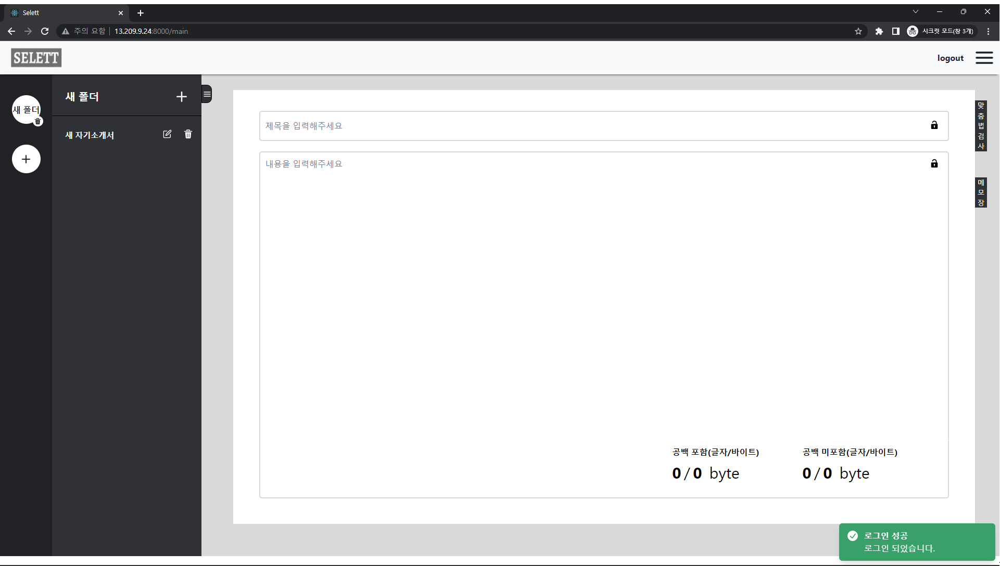
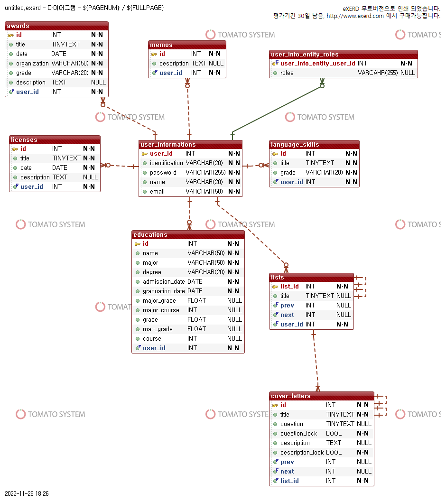

# Selett

> 편리하고 간단한 UI와 자기소개서만을 위한 특화된 기능으로 불편함을 해소하는 자기소개서 작성 웹 서비스

---

# 프로젝트 개요

### 개발 동기

* 각 문항 별 파일 생성 또는 한 파일 내에 길게 작성
* 초안 작성시 글자 수를 따로 세거나 문법 검사를 따로 함
* 제목과 같은 페이지에서 작성 (Ctrl + A 등 사소한 불편함)
* 회사 별로 관리하려면 폴더 등으로 따로 관리해야 함
* 다른 환경에서 이어 작성하고 싶을 때 클라우드 등을 이용해야 함

> 자기소개서 작성시 위와 같은 사소한 불편함이 있었고, 이러한 불편함을 해결할 수 있는 웹이 있으면 좋을 것 같았다.

### 개발 목표

* 교내 프로젝트 동아리 WAP(Why Are you Programming)의 동아리 활동
* 학기 중 하나의 프로젝트를 완성
* 평소 공부하고 싶었던 기술 스택에 대한 스터디 (React, Recoil, Spring boot, AWS EC2, AWS RDS)

### 개발 프로세스

* 9.19 아이디어 최종 선정
* 9.30 기능 최종 명세
* 10.05 DB Schema 설계 및 ER-DIAGRAM 작성
* 10.30 AWS EC2, AWS RDS 등 클라우드 시스템을 활용한 협업
* 11.28 서비스 테스팅
* 11.30 디버깅

> 총 기간 : 74일 / 주 1회 2시간 대면 팀 회의 진행

### 주요 기능

* 자기소개서 작성
* 자기소개서 폴더 및 파일 관리
* 글자 수 세기
* 맞춤법 검사
* 개인 프로필 관리

### 팀 구성원

* 백엔드 - 2명
* 프론트엔드 - 3명

---

# 소개 및 구성

### UI
* 로그인

* 메인

### DB Schema
* ER-DIAGRAM 물리명

### API spec document
* Swagger

---
